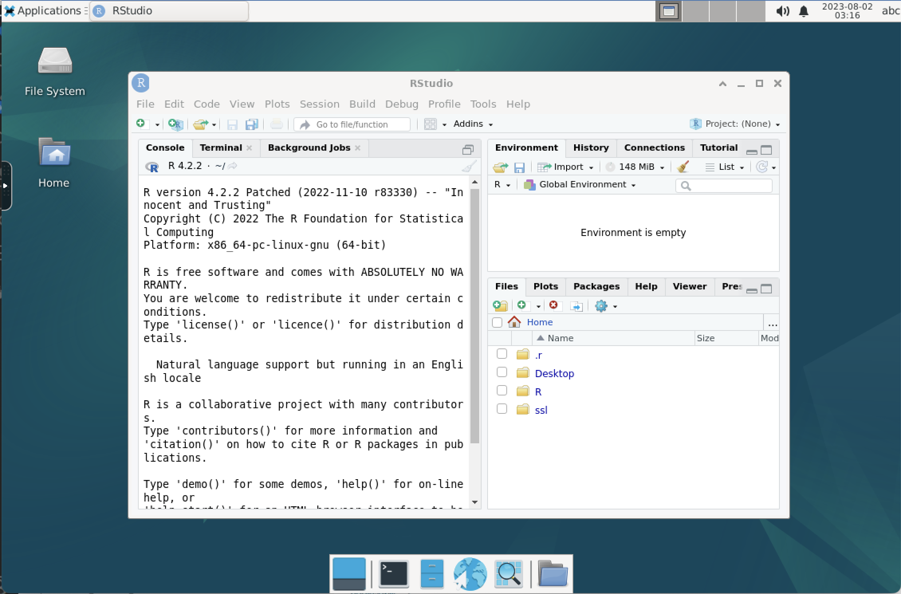

# SignalFlow Development
## SignalFlow Docker Stacks

SignalFlow Docker Stacks are ready-to-run workstation Docker images contain the big "three" platforms for EEG analysis: MATLAB, Python, and R. When active the images allow browser access to either a full desktop experience or web-based notebooks. All applications can access the same underlying file volumes.

Images were built from core KASM workstation images and adding layers for each application. Both *focal* and *jammy* versions have feature parity, but we envision the *jammy* version based on Ubuntu 22 will continue development.




Notes:

* Add ` --gpus all` if [nvidia toolkit](https://github.com/NVIDIA/nvidia-docker) for docker is installed.
* v1 is deprecated based on an outdated framework
* tested on Windows and Linux AMD64 hosts; not yet built for ARM hosting
* source code including docker build files are available on Github


## Quick Start
Example:
* :focal (based on Ubuntu 20.04)

``` 
docker run --rm -it --shm-size=512m -p 6901:6901 -v /path/to/local/storage/:/srv \
       -e  VNC_PW=password -e START_XFCE4=1 cincibrainlab/signalflow-development:focal
```
* :jammy(based on Ubuntu 22.04)

```
docker run --rm -it --shm-size=512m -p 6901:6901 -v /path/to/local/storage/:/srv \ 
       -e VNC_PW=password -e START_XFCE4=1 cincibrainlab/signalflow-development:jammy
```

DockerHub: https://hub.docker.com/repository/docker/cincibrainlab/signalflow-development/general


## Features
Provides a full Linux desktop environment with Xfce, a scientific computing environment with Matlab and R, document authoring tools like Quarto, and developer tools - preconfigured for convenience on an academic research computing platform.

- Base image: linuxserver/baseimage-kasmvnc:debianbookworm 
- Installs packages: 
  - Xfce desktop environment, Chromimum, Matlab, R, RStudio, Quarto, Pandoc, VSCode, GitHub Desktop, GitKraken
- Configures Matlab R2023a with key toolboxes
- Installs R 4.3 and key R packages like tidyverse, pacman, quarto
- Configures locale, installs texlive for PDF rendering
- Installs developer tools like VSCode, GitHub Desktop, GitKraken
- Installs helpful packages like imagemagick, inkscape, zip/unzip
- Configures `.desktop` files for no-sandbox mode for security
- Creates `matlab` user with sudo permissions for convenience
- Exposes port 3000 and sets up volume at `/config`

*Matlab Toolboxes installed suitable for HAPPE, MADE pipelines*
- Parallel Computing Toolbox
- Image Processing Toolbox  
- Signal Processing Toolbox
- Image Processing Toolbox
- Optimization Toolbox
- Statistics and Machine Learning Toolbox
- Wavelet Toolbox

## License

This project is licensed under the terms of the MIT License.

## Maintainer
This project is maintained by Ernest Pedapati (ernest.pedapati@cchmc.org).
