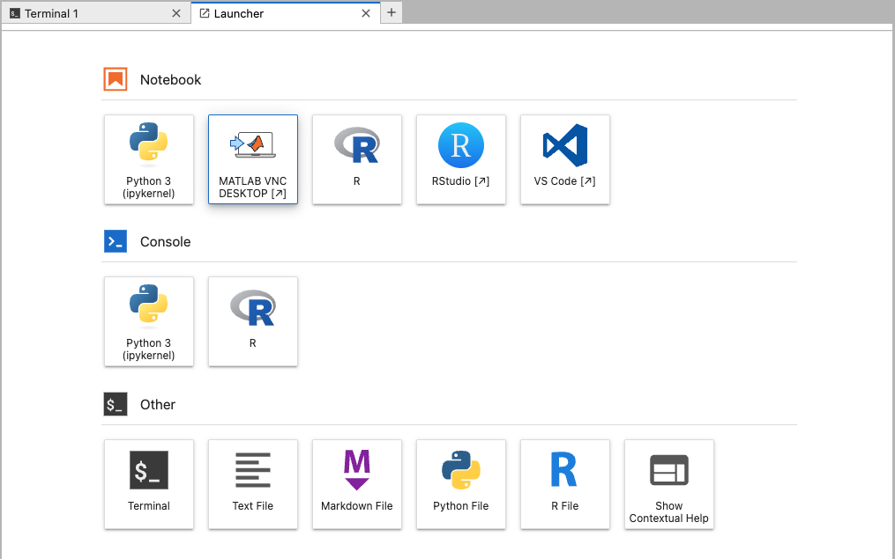

# SignalFlow JupyterHub Docker Image

This Docker image comes with MATLAB and MATLAB Integration for Jupyter (VNC) installed on a base image of `jupyter/base-notebook`.



## Features
- MATLAB release: `r2023a` (configurable)
- MATLAB products: `MATLAB`, `Parallel_Computing_Toolbox`, `Image_Processing_Toolbox`, `Signal_Processing_Toolbox`, `Optimization_Toolbox`, `Statistics_and_Machine_Learning_Toolbox`, `Wavelet_Toolbox` (configurable)
- Network License Server support
- VNC support for MATLAB Integration for Jupyter
- VSCode Server support
- Jupyter Notebook extensions & packages
- RStudio support
- JupyterLab with AI capabilities (via `jupyter_ai` and `openai`)
- All applications proxied through a single port (default: 8888)

## How to Use This Docker Image

1. Install Docker on your machine. Follow the instructions at [Docker's official website](https://docs.docker.com/get-docker/).
2. Pull the Docker image from Docker Hub:
    ```
    docker pull cincibrainlab/signalflow-jupyterhub
    ```
3. Run the Docker container:
    ```
    docker run -p 8888:8888 cincibrainlab/signalflow-jupyterhub
    ```
4. Open your web browser and navigate to `http://localhost:8888`. You should see the JupyterLab interface.

## License

This project is licensed under the terms of the MIT License.

## Maintainer
This project is maintained by Ernest Pedapati (ernest.pedapati@cchmc.org).
